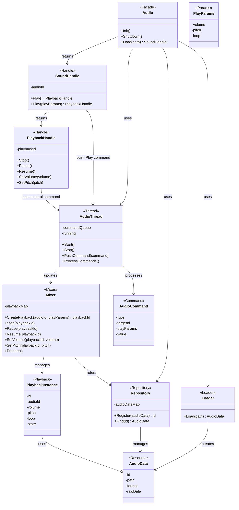

```mermaid
classDiagram

class Audio {
  <<Facade>>
  +Init()
  +Shutdown()
  +Load(path) SoundHandle
}

class Loader {
  <<Loader>>
  +Load(path) AudioData
}

class Repository {
  <<Repository>>
  -audioDataMap
  +Register(audioData) id
  +Find(id) AudioData
}

class Mixer {
  <<Mixer>>
  -playbackMap
  +CreatePlayback(audioId, playParams) playbackId
  +Stop(playbackId)
  +Pause(playbackId)
  +Resume(playbackId)
  +SetVolume(playbackId, volume)
  +SetPitch(playbackId, pitch)
  +Process()
}

class AudioThread {
  <<Thread>>
  -commandQueue
  -running
  +Start()
  +Stop()
  +PushCommand(command)
  +ProcessCommands()
}

class SoundHandle {
  <<Handle>>
  -audioId
  +Play() PlaybackHandle
  +Play(playParams) PlaybackHandle
}

class PlaybackHandle {
  <<Handle>>
  -playbackId
  +Stop()
  +Pause()
  +Resume()
  +SetVolume(volume)
  +SetPitch(pitch)
}

class AudioData {
  <<Resource>>
  -id
  -path
  -format
  -rawData
}

class PlaybackInstance {
  <<Playback>>
  -id
  -audioId
  -volume
  -pitch
  -loop
  -state
}

class PlayParams {
  <<Params>>
  -volume
  -pitch
  -loop
}

class AudioCommand {
  <<Command>>
  -type
  -targetId
  -playParams
  -value
}

Audio --> Loader : uses
Audio --> Repository : uses
Audio --> AudioThread : uses
Audio --> SoundHandle : returns

Loader --> AudioData : creates
Repository --> AudioData : manages

SoundHandle --> AudioThread : push Play command
SoundHandle --> PlaybackHandle : returns

PlaybackHandle --> AudioThread : push control command

AudioThread --> AudioCommand : processes
AudioThread --> Mixer : updates

Mixer --> PlaybackInstance : manages
Mixer --> Repository : refers
PlaybackInstance --> AudioData : uses
```